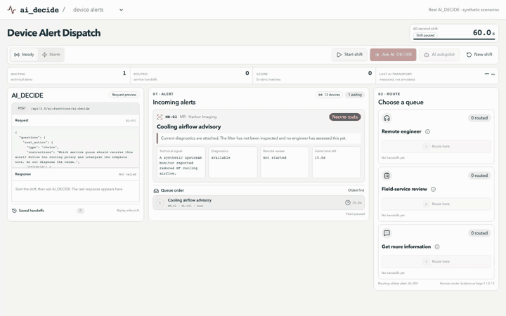
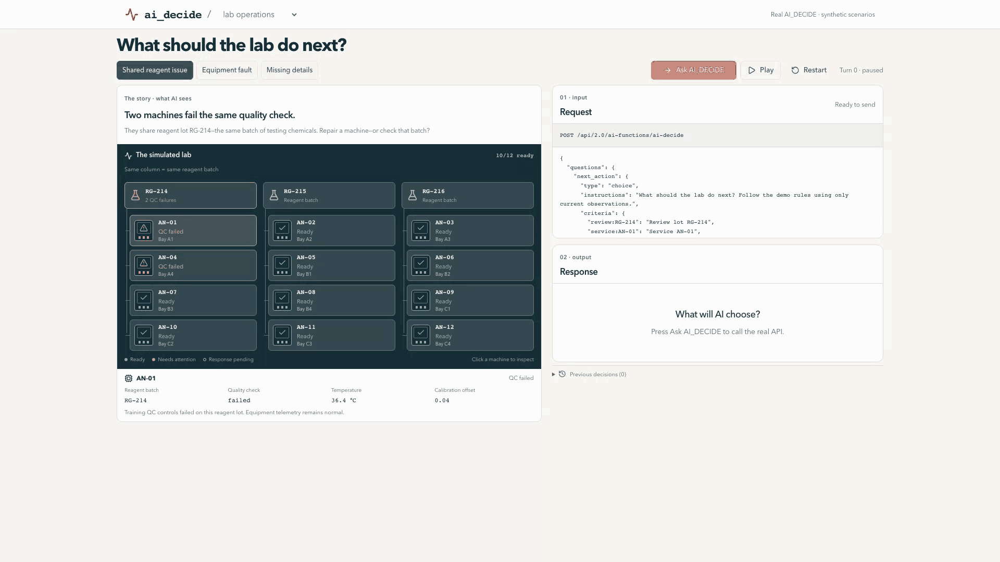

# AI_DECIDE MedTech Demos

One Databricks App, two switchable games. **Device alerts** opens by default. Both games call the real AI_DECIDE REST API, display the exact request and response, and save evidence in Lakebase.

## Device Alert Dispatch



Route synthetic MR and CT service alerts during a 60-second shift. AI_DECIDE chooses:

- **Remote engineer** — send available diagnostics for remote investigation.
- **Field-service review** — hand off an existing recommendation for physical inspection.
- **Get more information** — request missing or stale evidence first.

The game shows the live alert, exact AI exchange, measured latency, queue choice, and score on one screen.

## Lab Operations



Observe the simulated lab, choose one move, apply it, and repeat. Stories cover a shared reagent issue, an equipment fault, and missing details.

## Real-world grounding

[GE HealthCare OnWatch](https://www.gehealthcare.com/en-us/services/digital-solutions/onwatch) describes technical alerts from connected imaging equipment that are reviewed by remote engineers, with on-site service when needed. GE also publishes an [MRI cooling-airflow example](https://landing1.gehealthcare.com/Innovation-Talk-Landing.html) where remote log review led to physical inspection and discovery of a saturated air filter.

The device game models only the **first service handoff**. It does not claim GE uses AI_DECIDE and does not diagnose, repair, dispatch, monitor patients, or make clinical decisions.

## Under the hood

```text
Synthetic operational state + governed policy → AI_DECIDE → simulated next action
                                                   ↓
                                      Lakebase decision evidence
```

Lakebase retains game state, the exact AI request and response, latency, and outcomes. Replay makes no new AI call.

**Real AI and database; synthetic devices, alerts, and actions.**

[Development](medtech-deviceops-live/README.md) · [AI_DECIDE REST API](https://docs.databricks.com/api/ai-functions/v1/ai-decide)
