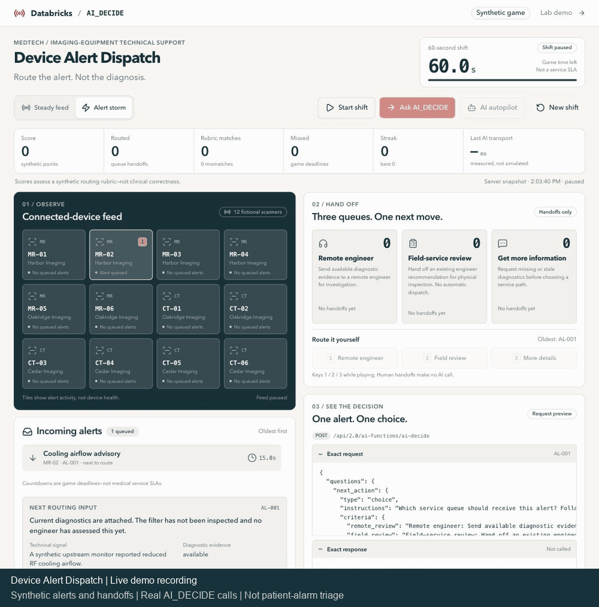

# Device Alert Dispatch

**Route the alert. Not the diagnosis.**



Recorded from the live app: synthetic alerts arrive, AI_DECIDE routes service handoffs, and Lakebase saves the decision history.

## The real workflow

[GE HealthCare OnWatch](https://www.gehealthcare.com/en-us/services/digital-solutions/onwatch) generates technical alerts from connected imaging equipment. Remote engineers investigate; on-site service follows when necessary. GE publishes an [MRI cooling-airflow example](https://landing1.gehealthcare.com/Innovation-Talk-Landing.html) where log review led to physical inspection and discovery of a saturated air filter.

Our game models the **first service handoff**, not that investigation. We do not claim GE uses AI_DECIDE.

## Play

1. Start a 60-second shift. Synthetic alerts arrive from fictional MR/CT scanners, even while AI is thinking.
2. Route the next alert yourself, ask AI_DECIDE, or turn on AI autopilot.
3. Choose **Remote engineer**, **Field-service review**, or **Get more information**.
4. Inspect the exact request, real response, measured API latency, and simulated handoff.

Try an alert storm. Match the demo routing rubric before alerts expire; missed and incorrect routes remain visible. Points and countdowns are **game mechanics, not medical deadlines or validated performance measures**.

## Under the hood

```text
Synthetic device alert + service policy → AI_DECIDE → queue handoff
```

The app calls `POST /api/2.0/ai-functions/ai-decide`. Lakebase retains game state and exact decision evidence; replay makes no new AI call.

**Real AI and database; synthetic devices, alerts, and actions.** No patient alarms, clinical decisions, device control, automatic dispatch, or repair.

[Development](medtech-deviceops-live/README.md) · [REST API](https://docs.databricks.com/api/ai-functions/v1/ai-decide) · [Previous lab demo](https://medtech-deviceops-live-7474645380671326.aws.databricksapps.com/?demo=lab)
